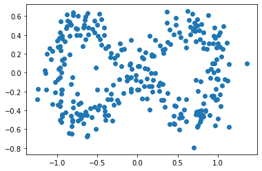
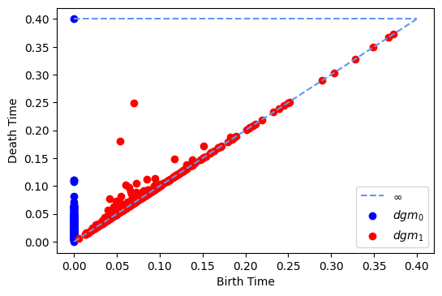

# computational_topology

A Python implementation of a simplicial complex, a filtration, an Alpha complex and Vietoris-Rips complex.

---
## SimplicialComplex

A simplicial complex is a set os points, segments, ..., n-dimensional simplices. To create one, you only need to provide the maximal simplices.

### Betti numbers

Used to distinguish topological spaces, they can also be used for simplicial complexes.
For example:

```python
from classes import SimplicialComplex

sc = SimplicialComplex()
sc.load('Klein bottle')
print('The Betti numbers of the Klein bottle are: ', sc.betti_nums())
```

We provide also an implementation of the incremental algorithm for calculating the betti numbers in R2.

---
## Filtration


A filtration is a sequence of a simplicial complexes.

---
## AlphaComplex

An AlphaComplex is a filtration determined by the Delaunay triangulation.

### Persistent homology
 
You can get the persistent diagram (dgm) by doing:


```python
from classes import AlphaComplex
import numpy as np
from random import gauss

o = 0.05
num = 100
f = lambda t: (np.cos(t) + gauss(0, o), np.cos(t) * np.sin(t) + gauss(0, o))
ls = np.arange(0,  2 * np.pi, 2 * np.pi/ num)
xs = np.ones(len(ls))
ys = np.ones(len(ls))
for i, x in enumerate(ls):
    xs[i], ys[i] = f(x)

# points representing the double torus
points = np.array(map(list, zip(xs, ys)))

alpha = AlphaComplex(points=points)
dgm = alpha.persistent_homology()
```

and then plot the persistent diagram:

````python
alpha.plot_persistent_homology(dgm=dgm, t='d')
````

or plot the persistent bar code:

````python
alpha.plot_persistent_homology(dgm=dgm, t='b')
````

For example giving this set of points that represent a double torus (genus 2),



we got the following persistent diagram, where it can be appreciated two holes that persist more than the average:



---

## Dependencies
- numpy
- scipy
- matplotlib